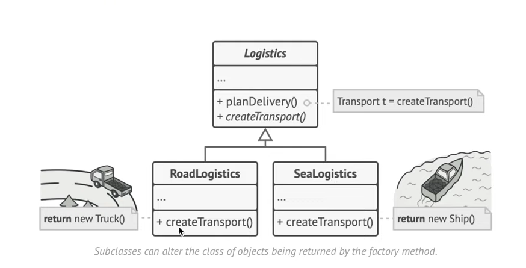

# Go_design_pattern
Tutorial Design Pattern with Go
```
//Chỉ cần struct dùng đủ phương thức interface thì nó sẽ tự implement
```

<h1>Strategy</h1>

Open/Closed Principle (OCP) là một trong 5 nguyên lý SOLID trong lập trình hướng đối tượng và thiết kế phần mềm.

✅ Định nghĩa:
“Software entities (classes, modules, functions, etc.) should be open for extension, but closed for modification.”
— Bertrand Meyer

➡️ Tạm dịch:
“Các thành phần phần mềm nên mở để mở rộng nhưng đóng để sửa đổi.”

📌 Ý nghĩa đơn giản:
Mở (Open): Bạn có thể mở rộng hành vi (behavior) của class/module bằng cách thêm code mới.

Đóng (Closed): Bạn không cần sửa code cũ đã hoạt động ổn định.

➡️ Điều này giúp code dễ bảo trì, giảm rủi ro lỗi khi cập nhật, và tuân thủ nguyên tắc DRY (Don't Repeat Yourself).


<h1>Factory-method</h1>
